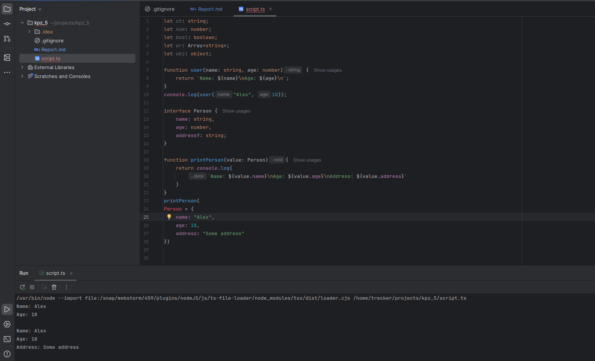
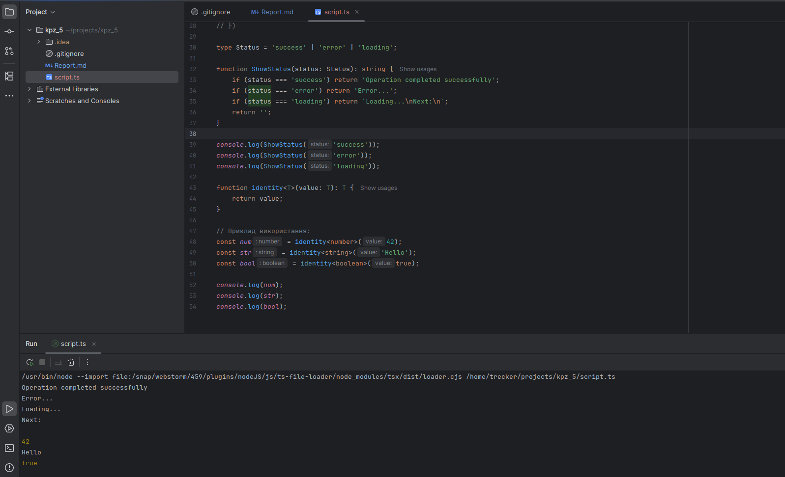
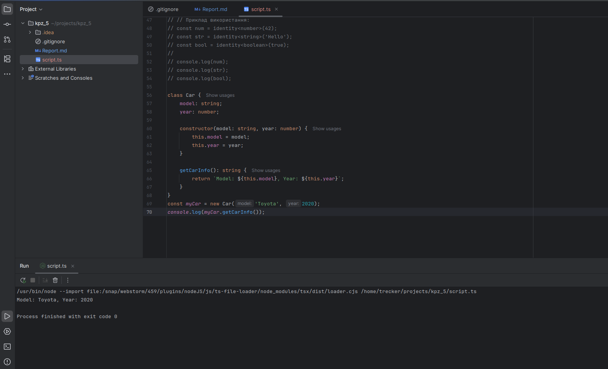

# Лабораторне заняття№1

***Ознайомлення з TypeScript***

Короткий опис виконаних завдань

1. Оголошено базові типи (string, number, boolean, Array, object) і функція з типами параметрів.
2. Створено інтерфейс Person з необов'язковим полем address і функція для виводу даних.
3. Оголошено об'єднаний тип Status і функція, яка виводить повідомлення згідно з його значенням.
4. Реалізовано дженерик-функцію identity<T> та використано її для number, string, boolean.
5. Створено клас Car з полями model і year, та методом getCarInfo() для виводу інформації.

### ФОТО:

**Завдання 1 і 2**



**Завдання 3 і 4**



**Завдання 5**



### Весь код

```
1------------
let st: string;
let nums: number;
let my_bool: boolean;
let ar: Array<string>;
let obj: object;

function user(name: string, age: number) {
    return `Name: ${name}\nAge: ${age}\n`;
}
console.log(user("Alex", 18));
2-------------
interface Person {
    name: string,
    age: number,
    address?: string;
}

function printPerson(value: Person){
    return console.log(
        `Name: ${value.name}\nAge: ${value.age}\nAddress: ${value.address}`
    )
}
printPerson(
Person = {
    name: "Alex",
    age: 18,
    address: "Some address"
})
3-------------
type Status = 'success' | 'error' | 'loading';

function ShowStatus(status: Status): string {
    if (status === 'success') return 'Operation completed successfully';
    if (status === 'error') return 'Error...';
    if (status === 'loading') return `Loading...\nNext:\n`;
    return '';
}

console.log(ShowStatus('success'));
console.log(ShowStatus('error'));
console.log(ShowStatus('loading'));

4-------------
function identity<T>(value: T): T {
    return value;
}

// Приклад використання:
const num = identity<number>(42);
const str = identity<string>('Hello');
const bool = identity<boolean>(true);

console.log(num);
console.log(str);
console.log(bool);

5-------------
class Car {
    model: string;
    year: number;

    constructor(model: string, year: number) {
        this.model = model;
        this.year = year;
    }

    getCarInfo(): string {
        return `Model: ${this.model}, Year: ${this.year}`;
    }
}
const myCar = new Car('Toyota', 2020);
console.log(myCar.getCarInfo());
```


