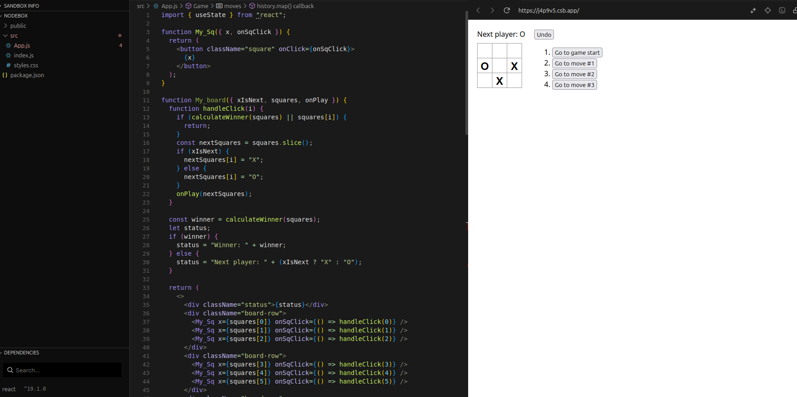

# Практичне заняття №5

**Мета**

Ознайомитися з базовими концепціями бібліотеки React, зокрема з компонентним підходом, декларативним стилем опису інтерфейсів та принципом оновлення стану. Сформувати початкове уявлення про створення інтерфейсів за допомогою React та підготуватись до реалізації власних UI-компонентів.

Завдання
1. Пройти розділ Quick Start на офіційному сайті React:
2. Ознайомитися з основними поняттями:
    - JSX
    - функціональні компоненти
    -  props
    -  state
    -  обробка подій
    -  рендеринг списків
    -  умовний рендеринг
    -  односторонній потік даних (one-way data flow)
3. Пройти інтерактивний підручник Tutorial: Tic-Tac-Toe, реалізувавши гру «Хрестики-нулики»
4. Звернути увагу на:
   - розбиття інтерфейсу на компоненти;
   - використання state для зберігання історії ходів;
   -  реалізацію функціональності «скасування ходу» (undo).

## Результат роботи

Пройшов 4 пункти

**Скріншот 4 роботи:**

Швидкий старт зрозумів і пройшов без особливих труднощів, у 4 роботі було не надто важко, але під кінець не багато плутався в коді через кількість рядків і невеликих не до розумінь

***Код хрестиків нуликів*** : https://codesandbox.io/p/sandbox/react-dev-forked-j4p9v5
