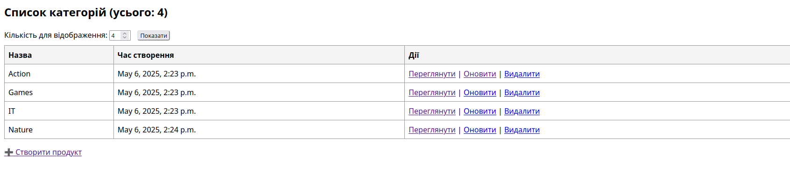
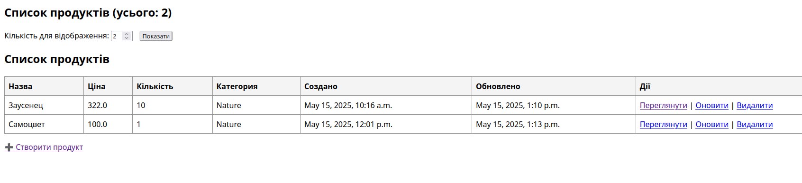
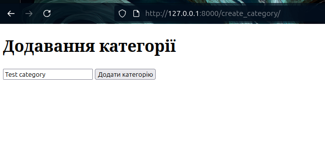
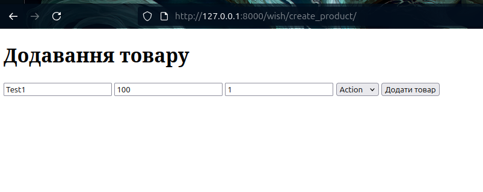
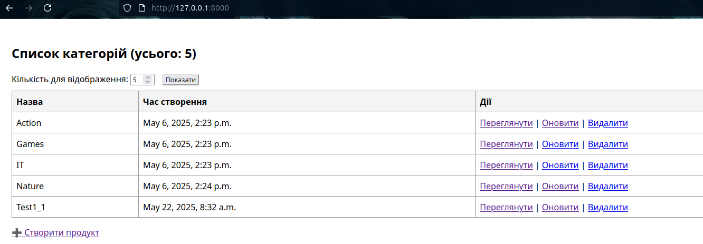
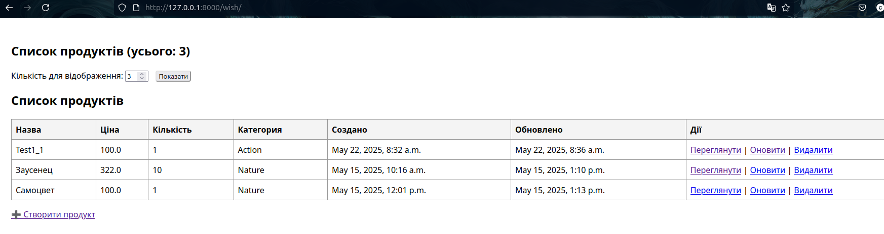
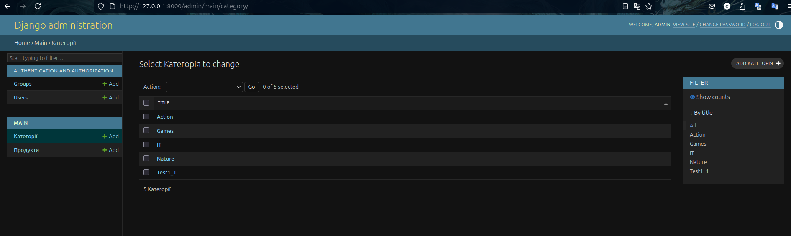
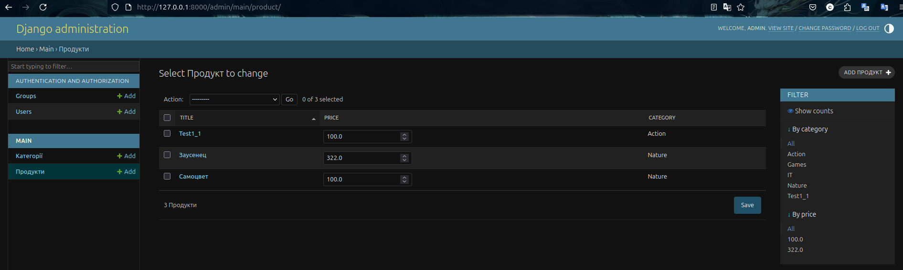

 # Лабораторная №8
 
### Розробка функціоналу CRUD.


### Реализація:

1. В програмному застосунку створити файл forms.py та додати код форм для
обраних моделей.

```from .models import Product, Category
from django.forms import ModelForm, TextInput, Select

class ProductForm(ModelForm):
    class Meta:
        model = Product

        fields = ['title', 'price', 'product_qty', 'category']

        widgets = {
            'title': TextInput(attrs={
                'class': 'form-control',
                'placeholder': 'Назва Товару'
            }),
            'price': TextInput(attrs={
                'class': 'form-control',
                'placeholder': 'Ціна Товару'
            }),
            'product_qty': TextInput(attrs={
                'class': 'form-control',
                'placeholder': 'Кількість Товару'
            }),
            'category': Select(attrs={
                'class': 'form-control'
            })
        }

class CategoryForm(ModelForm):
    class Meta:
        model = Category
        fields = ['title']
        widgets = {
            'title': TextInput(attrs={
                'class': 'form-control',
                'placeholder': 'Назва Товару'
            })
        }
```

***2-10. Коротко, реалізувати операції CRUD і api для взаємодії для мінімум двох таблиць***

**Головна сторінка категорій**



**Головна сторінка продуктів**



---
**Приклад добавлення категорій**



**Приклад добавлення продуктів**



---
**Приклад оновлення категорій**


**Приклад оновлення продуктів**


---
**Приклад видалення категорій**


**Приклад видалення продуктів**


**Результат категорій**



**Результат продуктів**



---
***11-15***
---

**Категоріі**



**Продукти**

