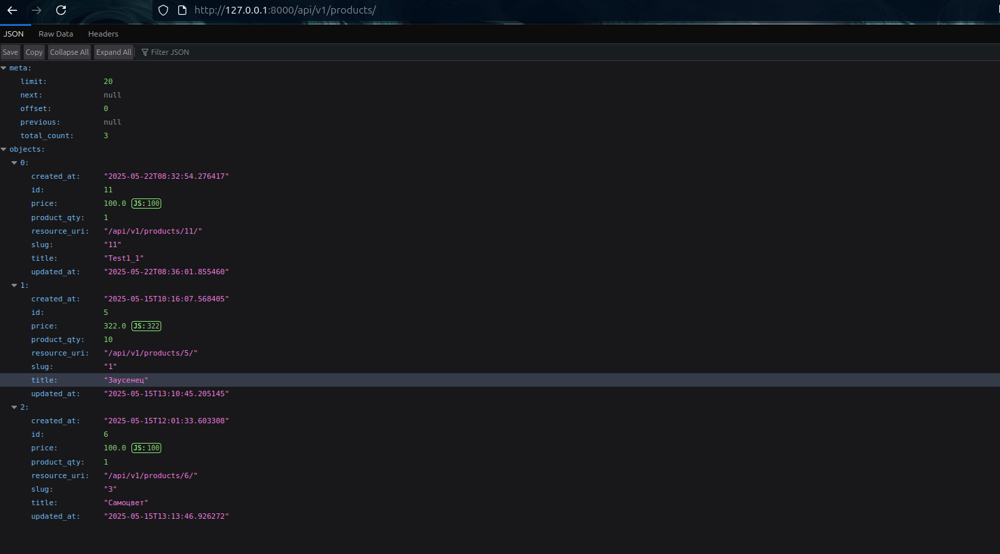
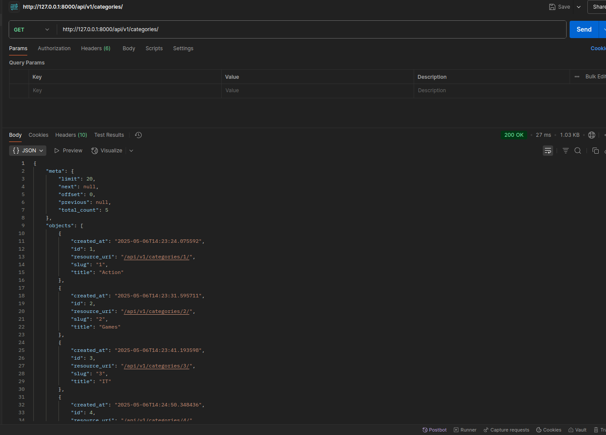

 # Лабораторная №9
 
### Розробка API.


### Реализація:

1-5
--

**Встановив Django-tastypie, після створив застосунок app і додав до нього фали resources
для реалізації моделей get і додав апі в INSTALLED_APPS і вказав url в base/urls.py**

resources.py:
-

```from tastypie.resources import ModelResource
from main.models import Category, Product

class CategoryResource(ModelResource):
    class Meta:
        queryset = Category.objects.all()
        resource_name = 'categories'
        allowed_methods = ['get']

class ProductResource(ModelResource):
    class Meta:
        queryset = Product.objects.all()
        resource_name = 'products'
        allowed_methods = ['get']
```
6-7
--

**Додав код в api/urls.py**
```from django.urls import path, include
from tastypie.api import Api
from .resources import CategoryResource, ProductResource


api_category = Api(api_name='v1')
api_category.register(CategoryResource())

api_product = Api(api_name='v1')
api_product.register(ProductResource())

urlpatterns = [
    path('', include(api_category.urls)),
    path('', include(api_product.urls)),
]
```

8-10(Тестування)
--

**Розширення**



**Postman:**

